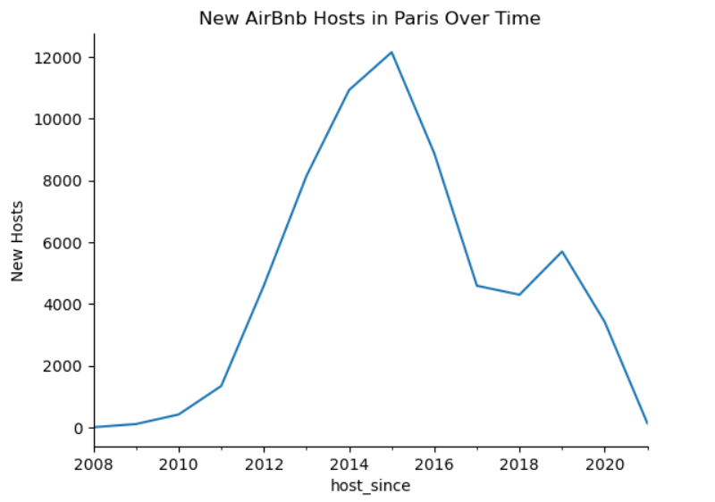

# Analyzing the Impact of 2015 Regulations on Airbnb Prices in Paris

This project explores Airbnb listing data to uncover key factors affecting pricing in the Paris market and analyze how the 2015 regulations influenced host activity and property prices. The analysis was conducted in Python using a Jupyter Notebook.

---

## 📍 Project Overview

As Airbnb’s popularity grew, Paris introduced regulations in 2015 aimed at limiting the number of short-term rental listings.  
This analysis investigates how those regulations impacted:
- The number of new hosts entering the market each year
- Pricing trends across neighborhoods and property sizes

The goal is to provide leadership with clear, data-driven insights into Airbnb’s Paris market dynamics.

---

## 🎯 Objectives

1. **Data Exploration & Cleaning**  
   - Load and inspect Airbnb listings data  
   - Profile fields, handle missing values, and correct data types  
   - Filter dataset to Paris listings only  

2. **Data Preparation & Aggregation**  
   - Calculate average prices by neighborhood and accommodation capacity  
   - Aggregate data by host registration year to measure new host trends  
   - Prepare clean, summarized DataFrames for visualization  

3. **Data Visualization & Insights**  
   - Visualize neighborhood pricing distributions  
   - Explore how accommodation size influences average price  
   - Analyze host and price trends over time, including the impact of 2015 regulations  

---

## 🧮 Tools Used

- **Python**
  - `pandas` for data manipulation  
  - `matplotlib` and `seaborn` for data visualization  
- **Jupyter Notebook** for interactive analysis and reporting  

---

## 📊 Key Visualizations

### 1. New Hosts Over Time
This line chart shows the number of new hosts joining Airbnb in Paris each year.  
After 2015, a visible decline in new host registrations was observed — signaling the effect of the newly imposed rental regulations.

---

### 2. Dual-Axis: New Hosts and Average Price Over Time
This dual-axis chart combines both new hosts and average price trends over time.  
Following 2015, **the number of new hosts dropped sharply**, while **average prices increased**, suggesting reduced competition and higher pricing power among remaining hosts.

---

## 🔍 Key Findings

- **2015 Regulations Lead to Fewer New Hosts, Higher Prices**  
  The introduction of rental limits in 2015 corresponded with a steep decline in new hosts entering the market, while average prices trended upward afterward.  

- **Accommodation Size and Pricing**  
  Listings that accommodated more guests consistently commanded higher prices, showing a strong positive relationship between capacity and rate.

---

## 📘 Project Files

- `airbnb_analysis_starter_notebook.ipynb` — Complete analysis and visualizations  
- `/images/` — Folder for chart images displayed above  

---

